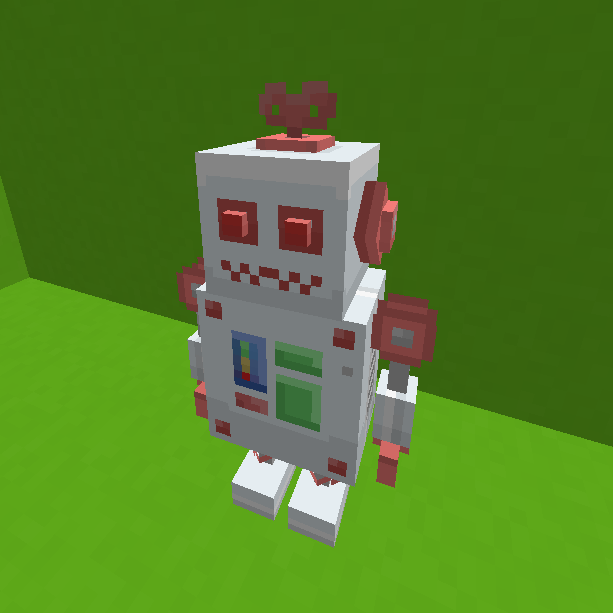

# 

A Spigot library and CLI tool for animating BlockBench models in Minecraft Java Edition.

## Features

- Display BlockBench models and animations directly in Minecraft.
- Automate the conversion process using the CLI tool:
    - Convert BlockBench models into Minecraft resource packs.
    - Generate Kotlin code to control models in a Spigot plugin.
- Uses packet-based rendering to minimize server load.

## Usage

```shell
$ java -jar animotion-converter-1.0.0-SNAPSHOT.jar
Usage: animotion-converter [<options>]

Options:
  -d, --directory=<path>  Resource pack path
  -o, --output=<path>     Output destination path
  -c, --code=<path>       Code destination path
  -f, --force             Answer yes to all confirmations
  --ignore-pack-format    Ignore unsupported pack_format error
  -v, --version           Show the version and exit
  -h, --help              Show this message and exit
```

Animotion converts BlockBench models into animated entities for Minecraft Java Edition. It provides both a Spigot library and a CLI tool to streamline the process.

### Resource Pack Generation (`-o` option)

- Converts BlockBench models into a Minecraft-compatible resource pack.
- Outputs textures, model JSON files, and other necessary resources.

**Example:**

```shell
$ java -jar animotion-converter-1.0.0-SNAPSHOT.jar -d path/to/resourcepack -o path/to/output
```

This command processes the specified resource pack and outputs the transformed assets to `path/to/output`.

### Kotlin Code Generation (`-c` option)

- Generates Kotlin source code to control animations in a Spigot plugin.
- Outputs classes and methods required for animation management.

**Example:**

```shell
$ java -jar animotion-converter-1.0.0-SNAPSHOT.jar -d path/to/resourcepack -c path/to/code
```

This command generates Kotlin code based on the specified resource pack and outputs it to `path/to/code`.

## Installation

To use the generated code, add the following dependency to your project:

### build.gradle.kts

```kotlin
repositories {
    maven(url = "https://s01.oss.sonatype.org/content/repositories/snapshots/")
}

dependencies {
    implementation("dev.s7a:animotion-api:1.0.0-SNAPSHOT")
}
```

### Main class

```kotlin
class ExamplePlugin : JavaPlugin() {
    private val animotion = Animotion(this)

    override fun onLoad() {
        animotion.onLoad()
    }

    override fun onEnable() {
        animotion.onEnable()
    }

    override fun onDisable() {
        animotion.onDisable()
    }
}
```

## Example (robit)



### Input Files

The input resource pack should be structured as follows:

```
C:\HOME\PROJECTS\ANIMOTION\CONVERTER\SRC\TEST\RESOURCES\PACKS\ROBIT
│   pack.mcmeta
│   
└───animotion
        robit.bbmodel
        settings.json
```

### Output Files

#### Resource Pack (`-o` option)

```shell
$ java -jar convert-cli/build/libs/animotion-converter-1.0.0-SNAPSHOT.jar -d convert/src/test/resources/packs/robit/ -o example/output
```

The generated resource pack will have the following structure:

```
example/output
│   pack.mcmeta
│   
├───animotion
│       robit.bbmodel
│       settings.json
│       
└───assets
    ├───animotion
    │   ├───models
    │   │   └───robit
    │   │           0.json
    │   │           1.json
    │   │           2.json
    │   │           3.json
    │   │           4.json
    │   │           5.json
    │   │           6.json
    │   │           7.json
    │   │
    │   └───textures
    │       └───item
    │           └───robit
    │                   0.png
    │
    └───minecraft
        └───models
            └───item
                └───stick.json
```

#### Kotlin Code (`-c` option)

```shell
$ java -jar convert-cli/build/libs/animotion-converter-1.0.0-SNAPSHOT.jar -d convert/src/test/resources/packs/robit/ -c example/src/main/kotlin/dev/s7a/animotion/generated/
```

The generated Kotlin code will have the following structure:

```
example/src/main/kotlin/dev/s7a/animotion/generated/
    Robit.kt
```

##### Example:

###### Spawn

```kotlin
// animotion: Animotion
val robit = Robit(animotion)

// player: Player
// location: Location
robit.spawn(player, location)
```

###### Play animation

```kotlin
// robit: Robit
// player: Player
robit.standing.play(player)
robit.walking.play(player)
robit.question.play(player)
robit.freeze.play(player)
```

## License

```
Animotion Custom License

Copyright (C) 2023 by wanko-zushi

This tool is protected by copyright law. Unauthorized modification or redistribution of the code is prohibited.

If you wish to use this tool, please comply with the following conditions:

1. Maintain the original copyright notice of this tool.
2. Modifying or redistributing this tool is not permitted.
3. In the event of a takedown request for the work by wanko-zushi, for any reason whatsoever, you must promptly remove the work.

This tool is provided without warranty. The author or copyright holder shall not be liable for any direct or indirect damages arising from the use of this tool.
```
